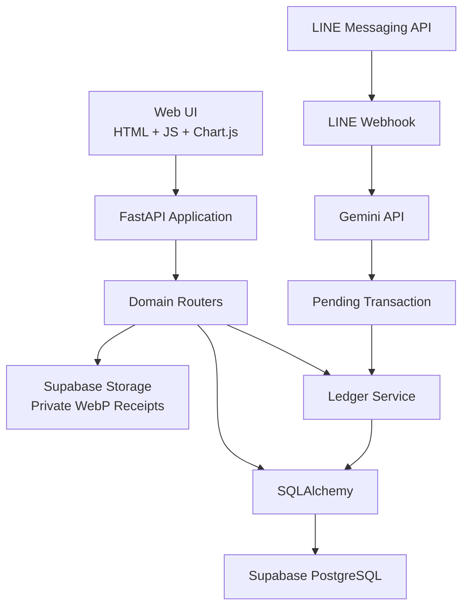
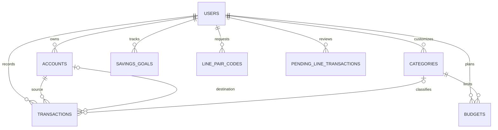
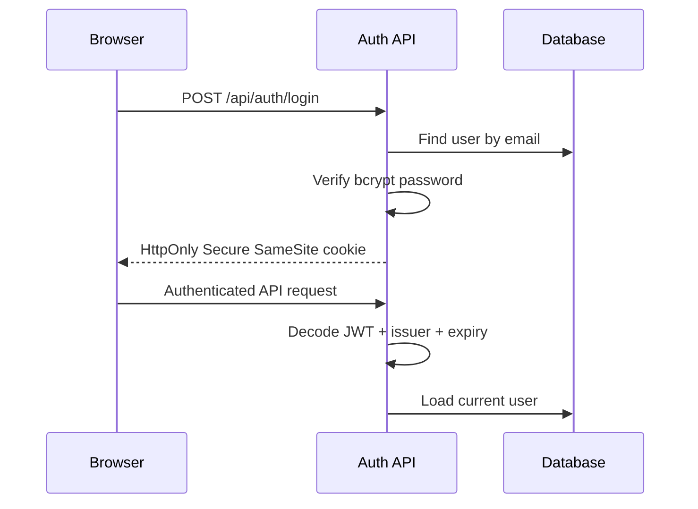
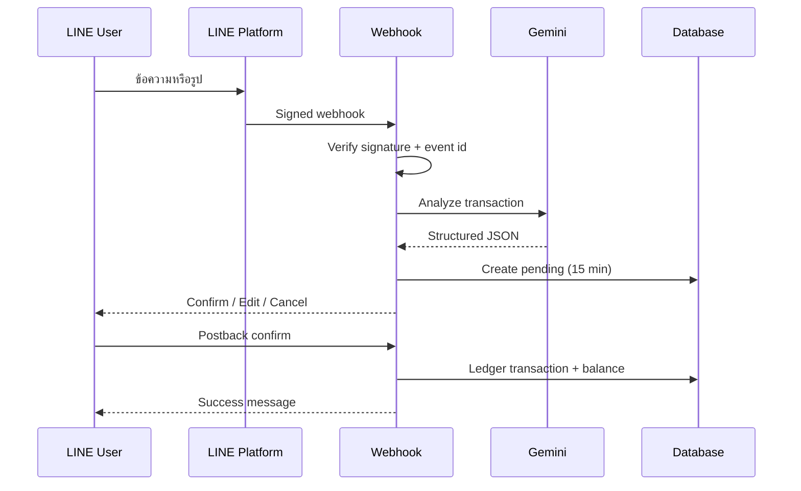
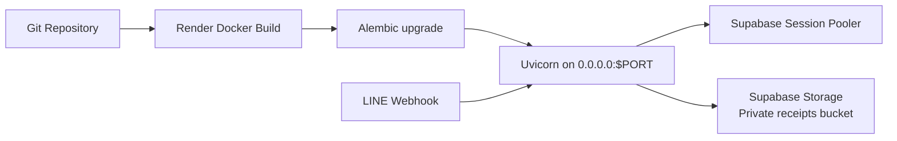

# Smart Finance 2.0 — System Architecture & Developer Handoff

เอกสารนี้สรุปโครงสร้างระบบจากโค้ดปัจจุบัน เพื่อใช้ส่งต่องาน วางแผนพัฒนา และป้องกันการแก้ส่วนหนึ่งแล้วกระทบความถูกต้องของยอดเงิน

## 1. ภาพรวมระบบ

Smart Finance 2.0 เป็นระบบบัญชีส่วนบุคคลแบบเว็บแอป มีช่องทางบันทึกข้อมูลสองทาง:

1. ผู้ใช้บันทึกผ่านหน้าเว็บ
2. ผู้ใช้ส่งข้อความหรือรูปใบเสร็จผ่าน LINE Bot ให้ Gemini วิเคราะห์ แล้วกดยืนยันก่อนบันทึก

เทคโนโลยีหลัก:

| ชั้นระบบ | เทคโนโลยี |
|---|---|
| Frontend | HTML, CSS, Vanilla JavaScript, Chart.js |
| Backend | Python 3.12, FastAPI |
| Validation | Pydantic |
| ORM | SQLAlchemy 2 |
| Database | PostgreSQL/Supabase; SQLite สำหรับพัฒนาในเครื่อง |
| Migration | Alembic |
| Authentication | JWT ใน HttpOnly Cookie; รองรับ Bearer Token |
| Password | bcrypt cost 12 |
| LINE | LINE Messaging API + Webhook |
| AI | Gemini generateContent API |
| Deployment | Docker + Render |
| Testing | pytest, Ruff, Node syntax check |

## 2. Component Architecture



หลักสำคัญ: ทุกการเปลี่ยนยอดบัญชีต้องผ่าน `services/ledger.py` ห้ามให้ Router, LINE handler หรือ Frontend แก้ `accounts.balance` โดยตรง

## 3. โครงสร้างโปรเจกต์

| ไฟล์/โฟลเดอร์ | หน้าที่ |
|---|---|
| `main.py` | สร้าง FastAPI app, middleware, lifecycle, static pages และ health check |
| `config.py` | อ่าน Environment Variables และตรวจ production configuration |
| `db.py` | SQLAlchemy engine, session และ declarative base |
| `models.py` | ORM models และความสัมพันธ์ฐานข้อมูล |
| `schemas.py` | Pydantic request/response validation |
| `security.py` | Password hashing, JWT cookie, current user และ rate limiter |
| `services/ledger.py` | กฎการเพิ่ม/ย้อนผลธุรกรรมและล็อกบัญชี |
| `services/receipt_storage.py` | ย่อ/แปลง WebP และจัดเก็บใบเสร็จใน Supabase Storage |
| `routers/auth.py` | สมัคร, login, logout และข้อมูลผู้ใช้ |
| `routers/accounts.py` | บัญชี กระเป๋าเงิน และ reconciliation |
| `routers/categories.py` | หมวดหมู่รายรับ/รายจ่าย |
| `routers/transactions.py` | CRUD ธุรกรรมและใบเสร็จ |
| `routers/budgets.py` | งบประมาณรายเดือน |
| `routers/savings.py` | เป้าหมายและยอดสะสม |
| `routers/reports.py` | Dashboard, รายงาน PDF, CSV สำรอง และ LINE pairing |
| `routers/line_webhook.py` | LINE signature, AI analysis, pending และ postback |
| `static/` | หน้า Dashboard, Login, Register, JavaScript และ CSS |
| `migrations/` | Alembic revisions |
| `supabase_schema.sql` | Fresh-install schema สำหรับ Supabase |
| `tests/` | ชุดทดสอบ authentication, ledger, security, LINE และ reports |

## 4. Domain Model



### ตารางหลัก

| ตาราง | หน้าที่ | กฎสำคัญ |
|---|---|---|
| `users` | บัญชีผู้ใช้และ LINE user ID | email และ line_user_id ไม่ซ้ำ |
| `accounts` | เงินสด ธนาคาร บัตร ลงทุน และอื่น ๆ | balance เป็น Numeric(14,2) |
| `categories` | หมวดรายรับ/รายจ่าย | รองรับหมวดระบบและหมวดเฉพาะผู้ใช้ |
| `transactions` | รายรับ รายจ่าย และโอนเงิน | amount > 0; transfer ต้องมีบัญชีปลายทาง |
| `budgets` | งบต่อหมวด/เดือน/ปี | หนึ่งงบต่อ user + category + period |
| `savings_goals` | เป้าหมายและยอดสะสม | เป็น tracker ไม่หักยอดบัญชีอัตโนมัติ |
| `line_pair_codes` | รหัสจับคู่ชั่วคราว | ใช้ครั้งเดียวและหมดอายุ |
| `pending_line_transactions` | รายการ AI ที่รอยืนยัน | pending/confirmed/cancelled/expired |
| `line_events` | ป้องกัน webhook ซ้ำ | event_key ไม่ซ้ำ |
| `alembic_version` | revision ของ schema | ปัจจุบัน `20260716_0002` |

## 5. กฎบัญชีและ Ledger

### ผลต่อยอดบัญชี

| ประเภท | บัญชีต้นทาง | บัญชีปลายทาง |
|---|---:|---:|
| income | + amount | — |
| expense | - amount | — |
| transfer | - amount | + amount |

กฎบังคับ:

- ใช้ `Decimal` และ `Numeric(14,2)`; ห้ามใช้ float ในการเขียนยอด
- PostgreSQL ใช้ row locking ผ่าน `with_for_update()`
- การแก้ transaction ต้องย้อนผลรายการเดิมก่อนใช้ค่าใหม่
- การลบ transaction ต้องคืนผลกระทบต่อยอด
- การ reconcile สร้าง adjustment transaction เพื่อ audit ได้
- บัญชีที่มีประวัติ transaction จะไม่ถูกลบ
- transfer ห้ามต้นทางและปลายทางเป็นบัญชีเดียวกัน
- category ต้องเป็นของผู้ใช้ หรือเป็น category ส่วนกลาง และชนิดต้องตรงกับ transaction

### จุดต่อขยายที่ถูกต้อง

ฟีเจอร์ใหม่ เช่น recurring transaction, import statement หรือ scheduled payment ต้องเรียก `create_transaction()`, `apply_effect()` และ `revert_transaction()` ใน Ledger Service ไม่ควรเขียน logic ยอดซ้ำใน Router ใหม่

## 6. Authentication และ Security

ลำดับ Login:



มาตรการปัจจุบัน:

- Password ใช้ bcrypt cost 12
- JWT ใช้ HS256, issuer, expiry และ unique jti
- Production cookie เป็น Secure, HttpOnly และ SameSite=Lax
- ตรวจ Origin สำหรับ API ที่เปลี่ยนข้อมูล
- CORS เป็น allowlist และเปิด credentials
- Security headers: CSP, X-Frame-Options, nosniff, Referrer-Policy และ Permissions-Policy
- Receipt เปิดผ่าน authenticated endpoint เท่านั้น
- รูปต้องเป็น JPEG/PNG/WebP และไม่เกินค่า `MAX_UPLOAD_BYTES`
- ข้อมูลที่สร้างใน DOM ถูก escape
- LINE webhook ตรวจ HMAC-SHA256 จาก raw request body
- API exception ภายในถูกซ่อน และส่ง request ID กลับเมื่อเกิด 500

## 7. API Map

| กลุ่ม | Prefix | Endpoint สำคัญ |
|---|---|---|
| Auth | `/api/auth` | POST register/login/logout, GET me |
| Accounts | `/api/accounts` | GET/POST, PUT/DELETE by id, POST reconcile |
| Categories | `/api/categories` | GET/POST, PUT/DELETE by id |
| Transactions | `/api/transactions` | GET/POST, PUT/DELETE by id, GET receipt |
| Budgets | `/api/budgets` | GET/POST, DELETE by id |
| Savings | `/api/savings` | GET/POST, PUT/DELETE, POST contribute |
| Reports | `/api/reports` | dashboard, PDF/CSV export, pairing code, LINE status/unlink |
| LINE | `/api/line/webhook` | POST webhook |
| Runtime | `/health` | Database readiness check |

ทุก endpoint ฝั่งผู้ใช้ต้อง filter ด้วย `user.id` เพื่อรักษา tenant isolation

## 8. LINE + Gemini Flow



รายละเอียด:

- Pairing เริ่มจากผู้ใช้ที่ login ขอรหัส `PF-XXXXXXXX`
- รหัสมีอายุประมาณ 10 นาทีและใช้ครั้งเดียว
- คำสั่งจับคู่คือ `ผูกบัญชี PF-XXXXXXXX`
- Gemini แปลงข้อความ/รูปเป็น type, amount, category, account, date และ note
- Pending transaction มีอายุ 15 นาที
- ยอดเงินเปลี่ยนเฉพาะเมื่อผู้ใช้กด Confirm
- event_key และ external_id ป้องกัน webhook หรือ confirm ซ้ำ
- ถ้าไม่มีบัญชี ระบบสร้างบัญชีเงินสดเมื่อยืนยันครั้งแรก
- ถ้ามีหลายบัญชีและ AI ระบุไม่ชัด ระบบจะไม่เดาและแจ้งให้ระบุชื่อบัญชี

## 9. Frontend Architecture

Frontend เป็น Single Dashboard แบบ Vanilla JavaScript:

- `auth.js`: session user และ authenticated fetch
- `login.js` / `register.js`: form submission
- `app.js`: state, API calls, rendering, modal actions และ charts
- `index.html`: Smart Finance Command Center
- `style.css`: responsive design system สำหรับ desktop/tablet/mobile

ข้อมูล frontend ไม่ใช่ source of truth ยอดเงินจริงอยู่ใน PostgreSQL และถูกเปลี่ยนผ่าน Backend เท่านั้น

จุดพัฒนาต่อที่ควรแยกเมื่อระบบใหญ่ขึ้น:

- แยก `app.js` เป็น modules: api, state, accounts, transactions, reports, ui
- เพิ่ม router ฝั่ง frontend หรือย้ายไป React/Vue เมื่อมีหลายหน้ามากขึ้น
- ใช้ design tokens และ component primitives กลาง
- เพิ่ม end-to-end tests สำหรับ critical flows

## 10. Deployment

### Production Path



ค่าหลัก:

| Variable | ค่า/หน้าที่ |
|---|---|
| `APP_ENV` | `production` |
| `PERSONAL_FINANCE_DATABASE_URL` | Supabase PostgreSQL Session Pooler URL |
| `SECRET_KEY` | สุ่มอย่างน้อย 32 ตัวอักษร |
| `AUTO_CREATE_TABLES` | `false` ใน production |
| `ALLOWED_ORIGINS` | URL จริงของ Web UI |
| `PORT` | Render แนะนำ 10000 |
| `RECEIPT_STORAGE_BACKEND` | `supabase` ใน production |
| `SUPABASE_URL` | Supabase Project URL |
| `SUPABASE_SERVICE_ROLE_KEY` | ใช้เฉพาะ backend ห้ามส่งไป browser |
| `SUPABASE_STORAGE_BUCKET` | Private bucket ชื่อ `receipts` |
| `LINE_CHANNEL_ACCESS_TOKEN` | ส่งข้อความ/โหลดรูปจาก LINE |
| `LINE_CHANNEL_SECRET` | ตรวจ webhook signature |
| `GEMINI_API_KEY` | วิเคราะห์ข้อความและรูป |
| `GEMINI_MODEL` | ปัจจุบัน `gemini-3.1-flash-lite` |

ฐานข้อมูล production ต้องใช้ Alembic หรือรัน `supabase_schema.sql` สำหรับ fresh install แล้ว stamp revision ให้ตรง ห้ามใช้ทั้ง `create_all()` และ Alembic กับ schema เดียวกันโดยไม่มี version baseline

## 11. Testing และ Quality Gates

คำสั่งมาตรฐาน:

```bash
pytest -q
ruff check .
node --check static/app.js
alembic -c personal_finance/alembic.ini current
```

ชุดทดสอบปัจจุบันครอบคลุม:

- สมัคร/Login/tenant isolation
- CRUD accounts, categories, budgets และ savings
- Ledger create/update/delete/reconcile
- Receipt authorization
- LINE signature, pairing, pending confirmation และ idempotency
- Dashboard/report/PDF
- Security headers และ production validation

ก่อน merge ฟีเจอร์ที่แตะยอดเงิน ต้องเพิ่ม test ทั้งผลต่อ transaction และยอดบัญชีหลัง create/update/delete

## 12. Known Limitations และความเสี่ยง

1. Rate limiter เก็บใน memory ของ process รีเซ็ตเมื่อ deploy และไม่แชร์ระหว่างหลาย instance
2. Gemini ถูกเรียกภายใน webhook request ทำให้ response ช้าและเสี่ยง LINE redelivery
3. Receipt พึ่ง persistent disk ของ instance; ยังไม่มี object storage abstraction
4. Backend ใช้ synchronous SQLAlchemy session รวมถึงใน async webhook
5. Frontend logic รวมอยู่ใน `app.js` ไฟล์ใหญ่
6. Savings goal เป็น tracker แยกจากเงินจริงและยังไม่มี transaction linkage
7. ยังไม่มี password reset, email verification, audit log กลาง หรือ admin console
8. ยังไม่มี monitoring/alerting ภายนอกและ structured error tracking
9. Supabase schema แบบวาง SQL ต้องรักษา revision ให้ตรงกับ Alembic
10. Rate limit สมัคร 5 ครั้ง/ชั่วโมงอาจรบกวนการทดสอบ เพราะไม่มี environment-specific policy

## 13. Roadmap แนะนำ

### Priority 0 — ความเสถียร Production

- ย้าย migration ไป pre-deploy step และให้ startup command ทำหน้าที่เปิด Uvicornอย่างเดียว
- จำกัด `create_all()` ให้ใช้เฉพาะ SQLite development
- เพิ่ม structured logging, Sentry/OpenTelemetry และ alert เมื่อ health check ล้ม
- เพิ่ม database backup/restore drill และ migration rollback procedure
- เพิ่ม startup configuration report ที่ไม่เปิดเผย secret

### Priority 1 — LINE และ Scalability

- รับ webhook แล้ว enqueue งานทันที; ประมวลผล Gemini ผ่าน worker
- ใช้ Redis สำหรับ distributed rate limit, idempotency cache และ job queue
- เพิ่ม lifecycle cleanup และรายงาน orphan objects ใน Supabase Storage
- เพิ่ม timeout, retry policy และ circuit breaker สำหรับ LINE/Gemini
- เพิ่มหน้าแสดงสถานะ LINE/Gemini และเหตุผลของรายการที่ประมวลผลไม่สำเร็จ

### Priority 2 — Product Features

- Recurring transactions และ scheduled reminders
- Import CSV/statement พร้อม duplicate detection
- เชื่อม savings contribution กับบัญชีจริงแบบ optional transfer
- Multi-currency และ exchange-rate snapshot
- เปรียบเทียบงบกับค่าใช้จ่ายหลายเดือน
- แจ้งเตือนงบใกล้เต็มผ่าน LINE
- Password reset, email verification และ account export/delete

### Priority 3 — Developer Experience

- แยก service layer เพิ่มสำหรับ reports, pairing และ file storage
- แยก frontend modules และเพิ่ม Playwright E2E
- สร้าง OpenAPI docs เฉพาะ staging
- เพิ่ม CI pipeline: lint → unit tests → migration test → container smoke test
- เพิ่ม seed fixtures และ staging environment แยกจาก production

## 14. กติกาสำหรับผู้พัฒนาคนถัดไป

- อย่าแก้ยอดบัญชีโดยตรง
- อย่าเชื่อข้อมูล user_id จาก client; ใช้ user จาก JWT
- อย่าเปิด receipt ผ่าน static URL
- อย่าเก็บ API key หรือ connection string ใน Git
- อย่า stamp Alembic โดยไม่ตรวจว่า schema มีครบ
- ทุก webhook ต้อง idempotent
- ทุก AI result ต้องผ่าน validation และ user confirmation
- ทุก query ข้อมูลส่วนตัวต้อง filter ตามเจ้าของ
- ทุก schema change ต้องมี migration และทดสอบกับสำเนาฐานข้อมูล
- ทุกฟีเจอร์ที่เปลี่ยนยอดต้องมี test สำหรับการย้อนผล

## 15. Definition of Done สำหรับฟีเจอร์ใหม่

ฟีเจอร์ถือว่าเสร็จเมื่อ:

- ผ่าน validation และ authorization
- ไม่ทำลาย tenant isolation
- ใช้ Ledger Service เมื่อแตะยอดเงิน
- มี migration เมื่อ schema เปลี่ยน
- มี unit/integration tests
- UI รองรับ mobile และ error state
- log ไม่เปิดเผย secret หรือข้อมูลอ่อนไหว
- README/Architecture ได้รับการอัปเดต
- ผ่าน `pytest`, `ruff` และ JavaScript syntax check
